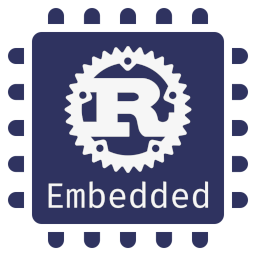
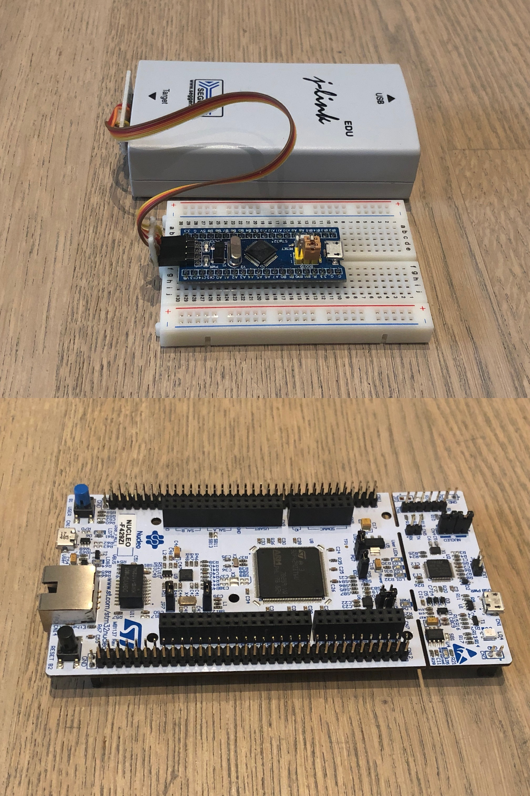
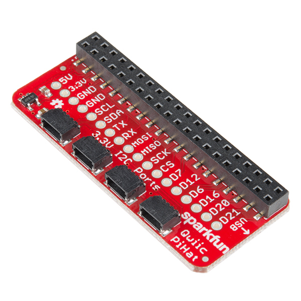

# Rust embedded



Goal: everyone grabs a blue pill and creates at least one low level driver.

*mail@uwe-arzt.de*
*https://uwe-arzt.de*

---

## Embedded defined

See <https://en.wikipedia.org/wiki/Embedded_system>

In our Case: A program running on a device without Monitor and Keyboard.

Often the need to operate without (power interruption sensitive) filesystem and a boot time as short as possible. On battery operated devices power saving modes needed.

---



## What hardware is needed

* Development board. We will use a blue pill, available for under 5,-- EUR
* A JTAG/SWD adapter. More expensive boards have it build in. I use a Segger j-link, other options are OpenOCD, BlackMagic, ST-Link.
* A cable to connect (There are **standard** connectors, but always check).

Many onboard ST-Link programmers can be reprogrammed to be JLinks.

Most common architectures are supported, but not the cheap ESPs with WLAN connection.

---

## Toolchain

Dependant on the concrete Microcontroler you use:

Bluepill: STM32F107RB -> thumbv7m-none-eabi
Nucleo: STM32F407 -> thumbv7em-none-eabihf

```zsh
rustup install target thumbv7em-none-eabihf
brew install cask segger-jlink
```

You also need a gnu toolchain for your target, i.e.

<https://developer.arm.com/tools-and-software/open-source-software/developer-tools/gnu-toolchain/gnu-rm/downloads>

Possible targets can be listed with:

```zsh
rustup target list
```

---

## crates

### Device support

crate for a special Microcontroller. Abstracts all the internal registers away. In the ARM case normally generated from a SVD (System View Description).

<https://github.com/stm32-rs/stm32-rs>

### Board support

crate for a specific board. It uses  a device support crate and adds all board specific features (i.e. HW on board).

<https://github.com/TeXitoi/blue-pill-quickstart>

---

## Blinky

```zsh
git clone https://github.com/TeXitoi/blue-pill-quickstart.git
cargo build
ls -l target/thumbv7m-none-eabi/debug/

JLinkGDBServer -if SWD -device STM32F103C8

arm-none-eabi-gdb
target remote localhost:2331
monitor interface swd

file "target/thumbv7m-none-eabi/debug/blue-pill-quickstart"
load
monitor reset 0
continue
```

can also be set in gdb startup file.

---

## Other target upload methods

### Serial connection

Some microcontrollers have a internal monitor, which allows to upload the binary file over a serial connection. This allows for a fast upload, but debugging is hard (print over serial).

### Mount Flash as disk

There are microcontroller (i.e. some mbed devices), which show up as Thumbdrive. You can copy the binary to the driver and after a reset the new uploaded binary will get started. Debugging is even harder.

---

## embedded-hal

<https://crates.io/crates/embedded-hal>

Interface definitions to keep drivers compatible over different processors, boards,...

You can program a driver against a I2C interface which is able to run on different platforms.

---

## linux-embedded-hal

Implementation for embedded Linux (often used on a Raspbery Pi)

```rust
// system specific
let i2c = I2cdev::new("/dev/i2c-1").unwrap();

// system neutral
let mut grideye = GridEye::new(i2c, Delay, Address::Standard);
```



Very helpful (if interface is available) to develop on a Linux machine, debugging is much easier.

---

## xxx-embedded-hal (1)

For the bluepill **stm32f1xx_hal**. At the moment every processor/every processor family uses it own embedded-hal crate.

Setup of pheriphals is mor complicated, because every pin has a bunch of configurable functions.


---

## xxx-embedded-hal (2)

```rust
let dp = stm32::Peripherals::take().unwrap();

let mut afio = dp.AFIO.constrain(&mut rcc.apb2);
let mut gpiob = dp.GPIOB.split(&mut rcc.apb2);

let scl = gpiob.pb8.into_alternate_open_drain(&mut gpiob.crh);
let sda = gpiob.pb9.into_alternate_open_drain(&mut gpiob.crh);

let i2c = BlockingI2c::i2c1(
  dp.I2C1,
  (scl, sda),
  &mut afio.mapr,
  Mode::Fast {
    frequency: 400_000,
    duty_cycle: DutyCycle::Ratio2to1,
  },
  clocks,
  &mut rcc.apb1,
  1000, 10, 1000, 1000,
);
```

---

## Bare Metal

**no-std** crates required

Check your dependencies

```zsh
cargo install cargo-nono

cargo nono check
as5048a: ✅
embedded-hal: ✅
linux-embedded-hal: ❌
```

---

### create your own low level driver

Check on [Awesome embedded Rust](https://github.com/rust-embedded/awesome-embedded-rust) if already available.

* Nowadays many ICs use I2C or SPI for Interfacing to the microcontroler. Both interfaces are available on the RPi, it is easy to start there first.
* The serial buses on ICs are sensitive to timing issues, so setting a breakpoint is often not an option.
* Get a evaluation board for the sensor and interface it to your board (there are a lot of different plugs for i.e. I2C, see Sparkfun QWIIC, Seedstudio Grove)
* Some ICs (i.e. AS5048) are avaiulable for different bus systems
* There are Protoboards, which can contain both bus systems (i.e. MikroE click)
* Get the datasheet for your IC

---

## Driver Overview

[AS5048](https://github.com/uwearzt/as5048a.git) -> SPI
[GridEYE](https://github.com/uwearzt/grideye.git) -> I2C

Helpful stuff: Most logic analysers can decode serial bus signals.

---

## Embedded OS

### There are at least some RTOS written in Rust:

RTFM - <https://github.com/japaric/cortex-m-rtfm>
TockOS - <https://www.tockos.org/>

### but also bindings to existing systems:

FreeRTOS - <https://github.com/hashmismatch/freertos.rs>
Apache  Mynewt - <https://medium.com/@ly.lee/hosting-embedded-rust-apps-on-apache-mynewt-with-stm32-blue-pill-c86b119fe5f>

---

## Links

[Rust embedded Book](https://rust-embedded.github.io/book/)
[Rust embedded WG github](https://github.com/rust-embedded)
[Awesome embedded Rust](https://github.com/rust-embedded/awesome-embedded-rust)
[@rustembedded](https://twitter.com/rustembedded)

---

## State (my humble opinion)

* Perfect for "all new projects"
* If you have to use existing stuff, evaluate a RTOS with Rust bindings for your logic
* Fast development, many old stuff in searches
* Many Libs and drivers are still missing, or are not longer maintained
* Lots of libs should be splitted into nostd + std parts

---

## Questions / Remarks

Be aware: many bluepills have the wrong pullup resistor on USB. See <http://amitesh-singh.github.io/stm32/2017/10/09/correcting-usbpullup-resistor.html>.
